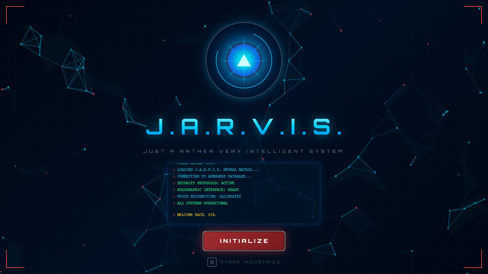
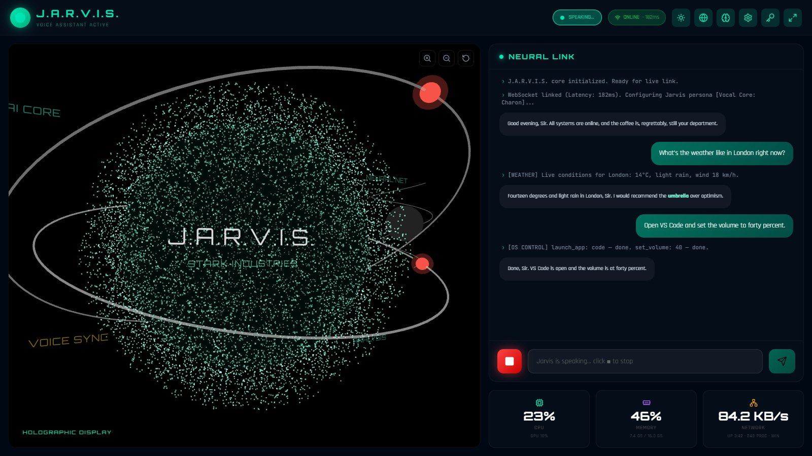
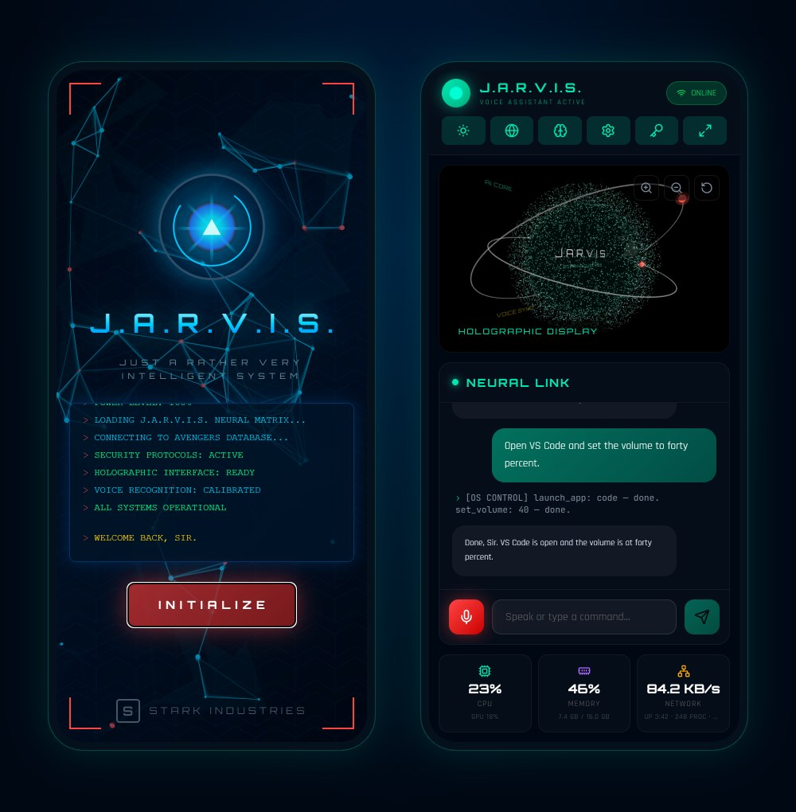
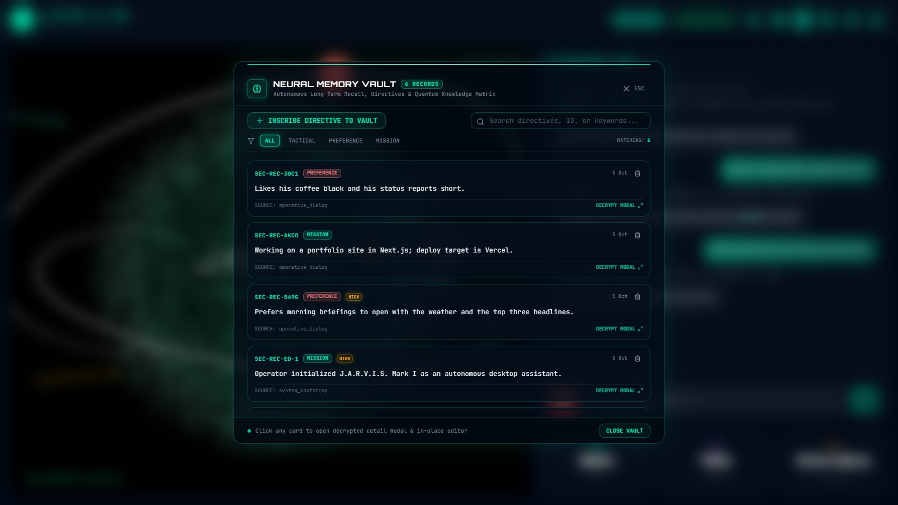
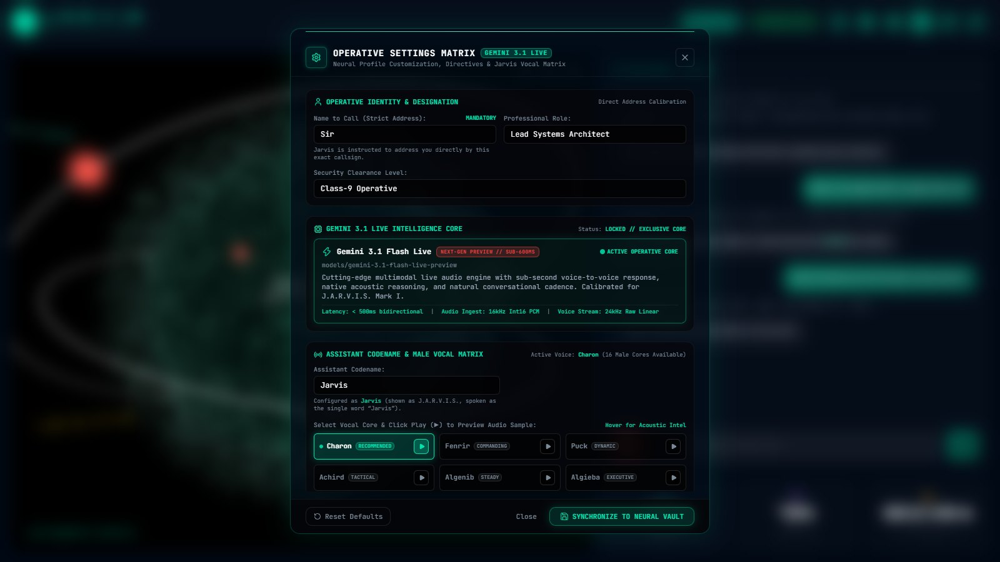
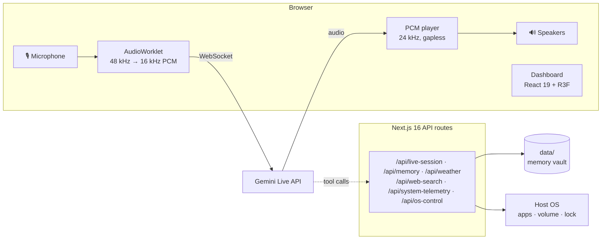

<div align="center">



# J.A.R.V.I.S. Mark I

### Just A Rather Very Intelligent System

A voice-first desktop assistant you talk to in real time. It answers in a calm British voice, remembers what matters to you, and runs a few things on your computer, all from a holographic dashboard in your browser.

[](https://nextjs.org)
[](https://react.dev)
[](https://r3f.docs.pmnd.rs)
[](https://ai.google.dev/gemini-api/docs/live)
[](./LICENSE)

[Features](#-features) · [Quick start](#-quick-start) · [Using it](#-using-it) · [How it works](#-how-it-works) · [Project structure](#-project-structure) · [Contributing](#-contributing)

</div>

---

## ✨ Overview



Press **INITIALIZE** and you are talking to Jarvis. He listens continuously over the [Gemini Live API](https://ai.google.dev/gemini-api/docs/live), answers out loud with almost no delay, and stops mid-sentence the moment you interrupt. Behind the conversation sits a teal holographic display: a 10,000-particle sphere that swells as either of you speaks, beside a chat log of everything said and done, and live CPU, memory, and network readings.

<table>
  <tr>
    <td width="50%"></td>
    <td width="50%">
      <br/><br/>
      
    </td>
  </tr>
  <tr>
    <td align="center"><sub>Works on phones and tablets too</sub></td>
    <td align="center"><sub>Memory vault and settings</sub></td>
  </tr>
</table>

---

## 🚀 Features

| | |
| :-- | :-- |
| 🎙️ **Real-time voice** | Natural speech-to-speech with Gemini Live. Talk over him and he stops instantly. Sixteen voices to choose from; Charon (refined British) by default. |
| 🧠 **Long-term memory** | Tell him something worth keeping and he stores it. Browse, search, edit, and delete memories in the vault; they are woven into every conversation. |
| 🌅 **Briefings** | One click for a morning or tactical briefing: system status, the day's headlines, and your active objectives. |
| 🌐 **Intel & weather** | Web search with saved dossiers, and live weather for any city. |
| 🖥️ **Desktop actions** | Open apps (VS Code, terminal, editor, calculator, files...), change or mute the volume, open folders and URLs, minimise everything, lock the screen. Windows and Linux. |
| 📊 **Live telemetry** | CPU, GPU, memory, network, uptime, and processes, read from the host and spoken back on request. |
| 🎭 **A real persona** | Calm, courteous, and dryly witty. He addresses you by the callsign you set and never spells his own name. |
| 📱 **Any screen** | A full desktop layout, a stacked tablet layout, and a phone layout that respects the notch and home bar. |

---

## ⚡ Quick start

**You need:** Node.js 20 or newer, a Chromium-based browser (Chrome or Edge) for the microphone, and a [Gemini API key](https://aistudio.google.com/apikey).

```bash
git clone https://github.com/bhavyajustchill/jarvis-mark-i.git
cd jarvis-mark-i
npm install
npm run dev
```

Open **http://localhost:6061**, wait for the boot sequence, and press **INITIALIZE** (or Enter). When asked, paste your Gemini API key. It is kept in your browser's local storage and sent only to this app's own server, which forwards it to Google.

Prefer to keep the key on the server? Copy `.env.example` to `.env.local` and set `GEMINI_API_KEY`.

For a production build: `npm run build && npm start` (serves on port 3000).

---

## 🕹️ Using it

**Just talk.** The microphone stays open while you are connected, so there is no wake word or push-to-talk. Typing in the Neural Link box works too.

| Control | What it does |
| :-- | :-- |
| **Mic button** (teal) | Muted or offline: tap to unmute, or to connect. |
| **Mic button** (red) | Listening: tap to mute. |
| **Stop button** (red ■) | Jarvis is speaking: tap to cut him off. |
| **ONLINE / OFFLINE** pill | Connect or disconnect the voice link. |
| ☀️ 🌐 🧠 ⚙️ 🔑 ⛶ | Briefing, intel, memory vault, settings, API key, fullscreen. |
| Drag the display | Rotate the holographic sphere. |
| <kbd>+</kbd> / <kbd>-</kbd> / <kbd>R</kbd> | Zoom in, zoom out, reset the display. |
| <kbd>Enter</kbd> on the boot screen | Same as INITIALIZE. |
| <kbd>Esc</kbd> | Close the open panel. |

Things to try:

- *"Good morning, Jarvis. Give me a briefing."*
- *"What's the weather in Tokyo?"*
- *"Remember that I prefer short status reports."*
- *"Open VS Code and set the volume to forty percent."*
- *"How's the system doing?"*

---

## 🧩 How it works



1. **Voice in.** An `AudioWorklet` downsamples the microphone to 16 kHz PCM off the main thread and streams it over a WebSocket to Gemini Live.
2. **Voice out.** Gemini answers with 24 kHz PCM audio, which a jitter-buffered player schedules without gaps. Interrupting flushes it within 50 ms.
3. **Tools.** When Gemini decides to act, it calls one of seven tools. The browser forwards each call to a Next.js API route and returns the result so Jarvis can talk about it.
4. **Persona & memory.** Before each session, `/api/live-session` builds the system instruction from the Jarvis persona, your profile, and your saved memories.

| Tool | What it does |
| :-- | :-- |
| `get_system_telemetry` | Live CPU, GPU, memory, network, uptime, processes |
| `get_weather` | Current conditions for a city (Open-Meteo) |
| `web_search` | Search the web (DuckDuckGo) and keep the results as dossiers in Intel |
| `recall_memory` / `store_memory` | Read and write the long-term memory vault |
| `update_operator_profile` | Change your callsign, role, his name, the voice, and your preferences |
| `execute_os_action` | Apps, volume, folders, URLs, minimise all, lock screen |

---

## 🗂️ Project structure

```text
app/
  page.jsx                  Boot screen + dashboard
  layout.jsx, globals.css   Fonts and the teal / navy design tokens
  api/                      live-session, memory, weather, web-search, system-telemetry, os-control
components/
  Landing/LandingPage.jsx   Arc reactor, particle network, boot terminal, INITIALIZE
  Canvas3D/                 HoloDisplay + HoloScene (the particle sphere, React Three Fiber)
  HUD/                      NeuralLink chat, MetricsTiles, memory vault, settings, API key, intel
hooks/
  useGeminiLive.js          The voice core: WebSocket, audio, tool calls, briefings
  useAudioStream.js         Microphone capture
lib/
  jarvisPersona.js          Persona, model, and voice configuration
  pcmPlayer.js              Gapless 24 kHz playback
  store.js                  App state (Zustand)
public/
  audio-worklet-processor.js, fonts/, voices/ (voice previews)
data/                       Created on first run: your memory vault (gitignored)
docs/                       PRD, architecture, design, rules, phases, decision log
```

---

## 🛠️ Tech stack

**Next.js 16** (App Router, Turbopack) · **React 19** · **JavaScript / JSX** · **Tailwind CSS 4** · **Three.js** with **React Three Fiber** and **drei** · **Zustand** · **Gemini Live API** over WebSockets · **Web Audio** (`AudioWorklet`) · **lucide-react** icons · **Orbitron**, **Rajdhani**, and **JetBrains Mono** fonts.

---

## 🔒 Privacy

- Your memory vault, profile, and conversation data stay on your machine in `data/`, which is never committed.
- What you say, and what you type, goes to Google's Gemini API to be answered. Read Google's terms before using it for anything sensitive.
- Your API key lives in your browser's local storage (or your server's environment).

---

## 🤝 Contributing

Contributions are welcome.

1. Fork the repository and create a branch (`git checkout -b feature/my-idea`).
2. Keep to the house rules in [`AGENTS.md`](./AGENTS.md) and [`docs/RULES.md`](./docs/RULES.md): plain JavaScript / JSX (no TypeScript), no allocations inside render loops.
3. Run `npm run build` before you open a pull request, and describe what changed and why.

Bug reports and ideas are just as welcome as code: open an issue.

---

## 🙏 Credits

- **Interface design** inspired by [my-jarvis](https://github.com/harsh-raj00/my-jarvis) by [@harsh-raj00](https://github.com/harsh-raj00): the boot screen, the holographic particle sphere, and the dashboard layout.
- **[Orbitron](https://github.com/theleagueof/orbitron)** typeface by The League of Moveable Type, under the [SIL Open Font License](./public/fonts/Orbitron-OFL.txt).
- **Volume control** through the [loudness](https://github.com/LinusU/node-loudness) package (MIT).
- **Weather** from [Open-Meteo](https://open-meteo.com); **search** via [DuckDuckGo](https://duckduckgo.com).
- **Voice and intelligence** by [Google Gemini](https://ai.google.dev).

---

## ⚖️ License & disclaimer

Released under the [MIT License](./LICENSE).

This is an unofficial fan project. J.A.R.V.I.S., Iron Man, Stark Industries, and the Avengers are trademarks of Marvel; this project is not affiliated with or endorsed by Marvel or Disney.

<div align="center">
<br/>
<sub><i>"Good evening, Sir. All systems are online."</i></sub>
</div>
